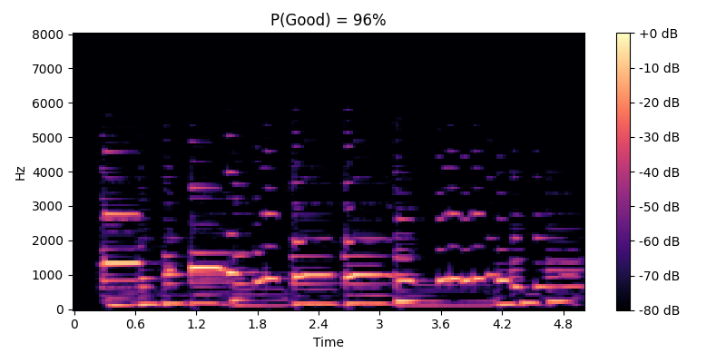
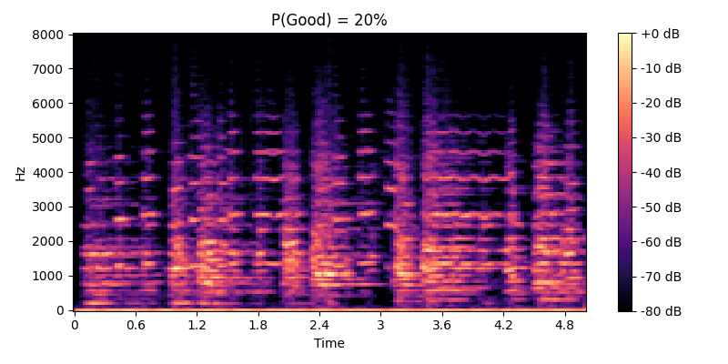
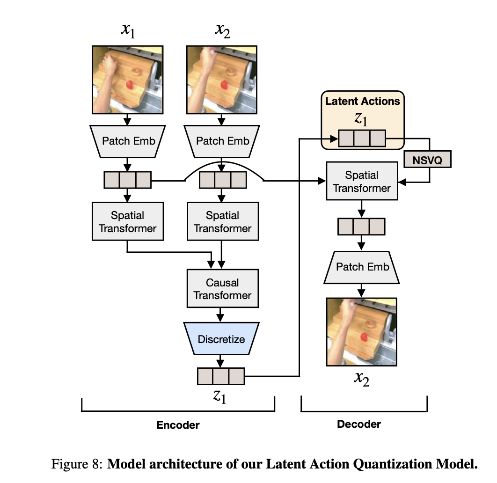

# Introduction
The inspiration for this was the original [Genie paper](https://arxiv.org/pdf/2402.15391) from Google DeepMind. If you haven't read it or seen [Genie3](https://deepmind.google/discover/blog/genie-3-a-new-frontier-for-world-models/) I highly recommend checking it out. The basic premis of these models is controllable generation without supervised labels, because collecting these labels (especially at fine granularity) can be quite expensive. What they do instead is train a Latent Action Model (LAM) to predict what action occurs between frames. Then they use these unsupervised labels for conditional generation. The main dataset used in the paper is a large collection of platformer videos collected from YouTube. They restrict the action space to 8 actions which they find produces actions for simple movement. A great idea that according to the paper both works and scales well!

## Problem Statement
I want to take the Genie approach and apply it to music. But instead of focusing on 'live' playability, to focus on semantic editing. I do this for two main reasons:
  1. There is a ton of backlash (understandably so) from artistic communnities on AI generated art. While I am participating in that from the AI side of things, I want my work to be interesting and acceptable to both sides.
  2. Editing (aka in-painting) should be a simpler task than pure generation (ignoring boundary conditions). And because I am quite data and compute limited, simpler tasks are preferable.

There are many high quality music generation models that let someone generate music from text, and if we go back far enough in time, even from sheet music. But at the moment text doesn't have sufficient fine grained control, and I'm not yet convinced its even the right medium for that level of control. Instead I propose to learn a set of actions for that very purpose, and most of the fun along the way will be discovering what those actions are. 

## Overview
Conceptually I follow the same approach as the initial Genie paper. I train an audio tokenizer, a latent action model, and finally a dynamics model. However each step in my training pipeline has some crucial deviations from Genie. I'll go through them one by one and explain what motivates them and the results.

## Data
I found an incredible dataset of Jazz recordings called [JazzSet](https://www.reddit.com/r/datasets/comments/1b73vz3/jazzset_large_audio_dataset_with_instrumentation/?utm_source=chatgpt.com) on Reddit. The recordings date from the late 19th centrury to the early 21st and vary substantially in quality. Data quality is curcial in training a strong model so I built a filtering pipeline to retain the highest quality recordings from the dataset. It's important to note that rejecting all "old" songs would have done a somewhat reasonable job of improving the overall audio quality, but at a great cost to data coverage. Instead I trained a simple model to help with filtering. I initially experimented with denoisers and similar models to clean up the audio quality instead of sacrificing data, but nothing I tried worked, and I didn't want to derail this project into training a denoiser before it even got started. There is plenty of derailing ahead.

## Data Filtering
I resampled all of the recordings to 16000Hz to reduce the computational training burden while maintaining reasonable peak audio quality. I randomly sampled ~200 songs, took the first 5 seconds from each, and labeled the quality as good or bad. The sampling was biased by age of the recording, anything somewhat recent had high quality so I didn't want to fill my training set with good quality recordings and bias the model accordingly. I trained an ExtraTrees model on simple statistics calculated over frequency bands from the Mel Spectrogram of the 5 second cuts. After training the model had ~80% accuracy which I deemed good enough for filtering. To filter, I calculated the same feature set over the entire dataset, predicted the probability of each 5 second segment being good, applied a gaussian filter to the probabilities, and passed a song through if the average probability was above 55%. I decided to pass/fail entire songs instead of their segments because I didn't want to deal with stitching segments together (despite this being common in NLP pre-training) and I didn't know what the final generative models context length would be (i.e. how much stitching would impact training). In hindsight maintaining sufficiently long (>30s) clips that were high quality likely would have increased my dataset size without too much overhead.

Here is an example of the difference in audio quality, the crackaling is a characateristic of old recording equipment and should be excluded from the training set.

| Good | Bad |
|------|-----|
| <audio controls><source src="samples/mel/JV-36144-1957-QmbSPzr8VX8LUrnatKVGRK9G9wZuVxah5VdMBgXVTpNBDn.wav-TS485813.wav" type="audio/wav"></audio> | <audio controls><source src="samples/mel/JV-12-1916-QmYZJNDBn5WPRNakbBi9UujN8dMrJo3n8vpaHo8RNon4xt.wav-JV-12-1916-QmYZJNDBn5WPRNakbBi9UujN8dMrJo3n8vpaHo8RNon4xt.wav" type="audio/wav"></audio> |

Here are the Mel Spectrograms for the first 5 seconds of each song that were used to generate the features for the quality classifier. The probability predicted by the classifier is in the title of each image. Notice how there is more color and blurred pixels in the second image, some of this comes from the crackle in the recording.

|  |  |

# Audio Tokenizer
## Architectures
From a conceptual POV I am anti quantization of continuous signals in tokenizers, why are we restricting the continuous nature of our data to some dumb integers in high dimensional space?? Why not use that continuous structure to our advantage?? He yells a little too loudly at no one in particular. An annoying looking man begins to say something about digital sensors being discrete by design before he is pummeled by the audience, everyone applauds. So anyway, I just don't like them conceptually, but they are the most performant tokenizers, so I understand why they are so commonly used.

At the onset of this project I spent some time fooling around with pretrained tokenziers and trying to build my own continuous tokenizers. It took a fair few failed attempts and mediocore results before I realized the main issue was that I was bad at googling and the solution already existed on ArXiv. Boom! [Diffusion Tokenizers](https://arxiv.org/pdf/2501.18593v1) why predict the entire latent space in one go when you can do it iteratively instead? A simple and profound idea that happened to be what I was messing with, just better and with many of the kinks worked out. I adjusted the architecture to work with 1D audio signals instead of 2D images, which mostly involved baking in the recent advances in audio tokenizers, and it pretty much worked out of the box! I love it when that happens. I highly recommend reading the Diffusion Tokenizers paper because it requires no specialized losses. Yes you heard me right, no collection of STFT losses, no GAN losses, no LIPSIS losses, or anything domain specific. Simply a diffusion objective that scales better than anyother image tokenizer. This worked quite well for low compression (16000Hz -> 50 tokens). Below are some sample reconstructions.

| Original | Reconstruction |
|----------|----------------|
| <audio controls><source src="samples/low/0_real.wav" type="audio/wav"></audio> | <audio controls><source src="samples/low/0_recon.wav" type="audio/wav"></audio> |
| <audio controls><source src="samples/low/1_real.wav" type="audio/wav"></audio> | <audio controls><source src="samples/low/1_recon.wav" type="audio/wav"></audio> |
| <audio controls><source src="samples/low/2_real.wav" type="audio/wav"></audio> | <audio controls><source src="samples/low/2_recon.wav" type="audio/wav"></audio> |
| <audio controls><source src="samples/low/3_real.wav" type="audio/wav"></audio> | <audio controls><source src="samples/low/3_recon.wav" type="audio/wav"></audio> |
| <audio controls><source src="samples/low/5_real.wav" type="audio/wav"></audio> | <audio controls><source src="samples/low/5_recon.wav" type="audio/wav"></audio> |

Unfortunately naively extending this approach to higher levels of compression failed miserably. Training a hierarchical tokenizer on top of the lower level tokenized latents also failed. [DC-AE](https://arxiv.org/pdf/2410.10733) to the rescue! The most insightful point in this paper is the realization that tokenizers have competing optimization processes that make learning difficult.
  Process 1: Move information from the sequence to channels, which is a difficult task for convolutional filters (large gradients)
  Process 2: Compress salient information and ditch noise (small gradients)
  
The different gradient magnitudes are an explanation for why adding additional blocks to enocders does not simply give better compression. The gradient signal is dominated by moving information around rather than better compression. DC-AE proposes to solve this problem by handling Process 1 with [Pixel Shuffle](https://docs.pytorch.org/docs/stable/generated/torch.nn.PixelShuffle.html), a technique that has been around a few years for better upsampling --you may have used this technique when training u-nets for segmentation. There are no learned parameters in this process, so the large gradients disappear. Then the compression is handled by a similar but learned residual transformation with small gradients. With this new approach the model only needs to learn what information to add rather than how to move it around to the further compressed representation. Integrating DC-AE removed the training bottleneck greatly increasing reconstruction quality. Unfortunately it also degraded controlability, reconstruction samples were high quality but quite different from the original sample. The model was essentially generating high quality samples at random rather than being conditioned on the input signal. Thankfully a few simple architectual modifications greatly improved conditioning, particularly AdaLN-Zero and improved skip connections.

## AdaLayerNorm-Zero and Skip Connections
The consistency model used by DiTo implements long range U-Net skip connections for every layer of every block of computation. They are passed from encoder to decoder and used to preserve fine grained information, allowing the model to focus on compressing global information. One issue with this approach is that right after downsampling that signal can be noisy, the model has had little time to refine the representation, and yet this noisy representation is being passed over to the decoder. A simple fix is to only select the last layer prior to downsampling as a skip connection, as it is the most refined representation at its scale, and pass that to all layers in the decoder with the same scale. This also reduces memory usage as skip connections are only being stored for every downsampling operation, not for every layer.

[AdaLN-Zero](https://arxiv.org/pdf/2212.09748) is a great and efficient technique for conditional generation. The conditioning signal is projected into scale, shift, and gate parameters that are used to modulate the computation of a residual block.

Below are some sample reconstructions from the high level tokenizer (16000Hz -> ~8 tokens). Notice that the musical themes are consitent between the original and reconstruction but that the audio quality varies. This is because the tokenizer is too small and is still early in training.

| Original | Reconstruction |
|----------|----------------|
| <audio controls><source src="samples/high/2_real.wav" type="audio/wav"></audio> | <audio controls><source src="samples/high/2_recon.wav" type="audio/wav"></audio> |
| <audio controls><source src="samples/high/3_real.wav" type="audio/wav"></audio> | <audio controls><source src="samples/high/3_recon.wav" type="audio/wav"></audio> |
| <audio controls><source src="samples/high/7_real.wav" type="audio/wav"></audio> | <audio controls><source src="samples/high/7_recon.wav" type="audio/wav"></audio> |

To force the model to learn higher level and more longterm features, I doubled the input sequence length to 2 seconds and then later increased it to 4 seconds. This was faster and more computationally efficient for my setup than starting training with 4 second segments. Directly applying the model to longer sequences works pretty well because the model is almost entirely convolutional, but doing a few thousand steps of training on the extended sequence length improves performance. Scaling up the model and training steps would improve audio quality and likely improve downstream learning. However, I have limitied compute and time, and these reconstructions maintain the most salient information from the original sample.

## Latent Shape
Taking advantage of the architectural modifications from DC-AE makes trading compression for latent dimension more tractable. The next question becomes what latent dimension has the best trade-off between compression and generation. Lets define what I mean by each of those terms in this specific context.
  Compression: How much salient information is conserved as the sequence length is compressed.
  Generation: How tractable is training a latent diffusion model (LDM) to generate these representations. Larger latent dimension makes this process more difficult.

The first tokenizer I trained compressed 16000Hz into 50 continuous tokens of dimension 128. Those with a background in image generation may back away in fear from a latent dimension of 128, most image tokenizers have between 4 and 16 dimensions, but 128 is somewhat standard in audio. Its easy to assume this is to compensate for audio tokenizers having larger compression ratios, but it is more likely due to the weakness of audio tokenizers. Image generation has made much more progress than audio and thus the tokenizers are better suited for the task. I improved the architecture and doubled the latent dimension as I scaled up the compression giving a model that compresses 16000Hz into ~8 tokens of dimension 256. Noticing that the reconstruction quality was substantially better than expected, I repeatedly retrained the model with the same spatial compression but reducing the latent dimension. First to 128 and then to 64 with no noticeable drop in quality. I found the best trade in reconstruction and generative quality came from compressing 16KHz into 32 tokens of dimension 16. 32 tokens gives sufficient spatial context without overencumbering the context window (30s of audio fits nicely in a standard context window of length 1024) and the low embedding dimension simplifies the generative task. Crucially, this is all without scaling the decoder to compensate for the smaller latent representation. As shown in the DiTo paper, scaling the decoder would improve reconstruction quality.

## Beats and Bars
Operating over arbitrary seconds of music seems reasonable at first. But music is continuous and its information density can vary substantially over time. Further, with the goal of tokenizing musical frames into sets of actions, it becomes more obvious that we want our compressed representations to contain some full fundamental unit of music. We do not want to be predicting tokens across musical boundaries. As best as possible we want our learning task to approximate predicting the next frame from a video.

Beats are a base unit of music and bars (or measures) are sets of beats. Using [Beat This!](https://github.com/CPJKU/beat_this) I was able to label beats and measures in my dataset with reasonable accuracy. Then clips can be segmented into measures for training. This reduces the amount of training data by several orders of magnitude and yet substantially improves validation performance, which can only be attributed to the simplification of the training process because of the added structure and consistency that training on measures enforces. In the future, augmentation could be applied to the measure segmentating pipeline to increase the scale of the measures dataset. For example, duplicate measures could be created with varying beat segmenation by adding noise to the boundaries. This should also act as a regularizer against inaccurate beat segmenation.

| Original | Reconstruction |
|----------|----------------|
| <audio controls><source src="samples/beats/5_real.wav" type="audio/wav"></audio> | <audio controls><source src="samples/beats/5_recon.wav" type="audio/wav"></audio> |
| <audio controls><source src="samples/beats/7_real.wav" type="audio/wav"></audio> | <audio controls><source src="samples/beats/7_recon.wav" type="audio/wav"></audio> |
| <audio controls><source src="samples/beats/8_real.wav" type="audio/wav"></audio> | <audio controls><source src="samples/beats/8_recon.wav" type="audio/wav"></audio> |

## End-to-End Measure Tokenization
We can make the above approach more elegant by removing the time-warping and learning and end-to-end variable to fixed leangth tokenizer over our dataset. [Perciever](https://arxiv.org/pdf/2103.03206) describes a general approach for tokenizing arbitrary modalities. It leverages cross and self-attention to compress the input sample into a latent array. With appropriate masking it can be used to tokenize varying input lengths, allowing the network to learn the time-warping and compression function simultaneously. This approach therefore has a higher performance ceiling as the input waveforms are clean and don't suffer from time warping artifacts. I imagine with sufficient data and compute that the learned network should outpreform the rubberband time-warping algorithm. The Perciever architecture does not have any convolutional layers, so the generated latent representation does not have a spatial bias. I believe an issue with action tokenization is that the Latent Action Model must learn to disentangle spatial information from global semantics to produce coherent actions. This Perciever architecture should ameliorate this issue, potentially leading to high quality action generation. To compensate for the lack of spatial bias and needing to learn the time-warping algorithm, the Perciever tokenizer requires substantially more parameters to reach parity in performance. The most critical design descions are the frequency of cross-attention layers and the waveform patch size. To make the input waveform sequence length managable a convolution with matching kernel and stride is applied prior to any attention layers.

Initial experiments show promise, but I do not have sufficient data or compute to scale the model to perform on par with the time-warping + convolutional tokenizer approach. All further experiments use the convolutional model.

# Latent Action Modeling (LAM)
Questions to consider:
  1. Input tokenized latents or the raw waveform?
  2. Enforce causality or block masking?
  3. Model Architecture?
  4. What do we want out action space to be?

## Input
Because I am compute poor I decided to train my Latent Action Model on the continuous tokenized latents from the previous step, instead of the raw waveform (which is what Genie did). I am likely leaving some performance on the floor by doing this, but for the sake of speed and progress, I think its a fair tradeoff. Plus, because of my somewhat narrow scope, the tokenizer is actually quite good, so hopefully the information being lost isn't crucial to this step. It also brings a substantial win for the sequence length. Training the model over 10s of data would be 160,000 samples using the waveform but only 80 - 500 for the different tokenizers. Using the tokenized latents also simplifies our lives if we want the LAM to be a transformer (which we do).

## Masking
Since I'm not going for real-time action controlled generation, causality isn't strictly necessary anywhere in the model. I plan on using this primarily for editing and inpainting, which corresponds better to random/segmented masking instead of causal masking. Causal masking has also been empirically shown to make generation more difficult. However some form of masking is required to ensure the latent actions provide the most salient information to the model that it cannot get from peaking ahead. I spent many expierments trying to get masking to work but it simply never preformed as well as enforcing causality. I also found using 2 "frames" (a frame being a single second of latent audio) to drastically simplify the training task and reduce memory consumption, making training substantially faster. Unfortunately, at later retrospection, 2 frames created an issue of the learned actions mostly containing temporaly redundant information. When extended to a longer sequence, as is the case for generation, the actions lose their advantage and are ignored. Despite the additional memory requirements, I found training with a sequence of at least 4 measures to be required for controlable downstream generation.

## Architecture
In this context, the primary question is how do we best handle spatial and temporal relationships? How much compute should be spent on spatial attention vs temporal attention? How should we order spatial and temporal attention layers? My initial experiments focused on interleaved 1:1 spatial to temporal attention layers (spatial -> temporal -> spatial -> temporal ...). Recently I transitioned to following the architecture descriped by [LAPA](https://arxiv.org/pdf/2410.11758). The paper still follows a 1:1 ratio but instead does all of the spatial attention first, followed by temporal attention. Many recent papers show emperically that ratios of 2:1, 3:1, and 4:1 can perform on par with 1:1 but save on compute (similar to the relationship between global and local attention in long context LLMs). My encoder uses a 2:1 ratio and the diffusion decoder is scaled proportionately to roughly balance parameters.

When inspecting model outputs, I noticed that some generations were incredibly faithful and high quality, while others missed the mark substantially. I believe the small codebook is at fault, because of the discrete nature the network is forced to cover the most common modes in the distribution and fail on the others. For comparison, it is typical when training DiTs over somewhat uniformly distributed data for performance to improve uniformly across the entire data manifold. That is not what I was seeing. This also caused larger gradient variance, potentially degrading learning. Deciding on an optimal codebook size for distribution coverage and usability is difficult. I decided to re-train with a codebook size of 64, hoping that it would cover a sufficient amount of the data manifold without being too unweildly large. Further research into a low dimension (yet constrained) continuos set of actions could resolve the problem of insufficient coverage. The difficulty then becomes making it easy and intuitive to use, this could also destroy the real-time aspect, its much easier to press a button than to tune a signal.

Providing the conditioning signals via AdaLN modulation consistently outperformed concatenation.

## Action Spaces and the Demon that is Quantization
### Considerations for Building an Action Space
The latent action space cardinality must be defined prior to training. It can always be reduced for inference, but with the Genie setup it cannot be grown progressively during training. Okay thats slightly misleading, one could stitch on additional codebook slots and continue training, but theres no learning of the codebook size here. An interesting research direction could be learning the codebook size as some functional of information gain. But for my purpose, enforcing a maximum cardinality is actually crucial. The intuition being that a small number of actions should force the model to learn more meaningful and interpretable actions. One could imagine a small codebook learning actions like: guitar solo, melancholy tune, up-beat melody; while a large codebook could learn much more granular actions like: piano plays c-note, increase tempo, play hi-hat. Although both approaches are worthwile, I am much more interested in the first set of actions than the second. The first set opens the door to people with musical sense but less musical talent (think [Rick Ruben](https://www.youtube.com/watch?v=h5EV-JCqAZc). The second set could allow highly talent musicians to play a much wider set of instruments without having to learn them (although imagining building that UI, bleh). The keen-eyed readers may have noticed that only some of the examples included instruments. With no additional conditioning it is likely that the latent actions will pertain to the most informative actions, which certainly includes instruments. This is an important point worth thinking about because it has a huge impact on the final model. One approach is to provide the set of instruments being played during a segment as additional conditioning, that way the model learns actions on top of instruments. Then in inference if an action like solo is learned, the user can select what instrument (from the conditioning set) should play that solo.

Interestingly I found that quantizing the difference between consequtive measures (as proposed by LAPA) was crucial to training. Quantizing the measures themselves caused immediate and unrecoverable codebook collapse. Its possible the is because the action model doesn't have sufficient capacity or temporal depth to adquately model the relation between measures.

### Vector Quantization
The input latent is a sequence, this lets us produce action vectors for any element in the sequence, introducing an extremely important trade-off between controlability, fidelity, and ease of use. Increasing the action sequence and codebook size increase the controlability and fidelity of the generation at the cost of usability. These hyperparameters define the number of knobs and the degrees of (knob) freedom the user has to play with. We want to target a high level of expressitivity while being manageable. Emperically I found that a single action, even with a large codebook, was not sufficient for high fidelity and controlable gneration. There action encoder simply cannot squeeze enough information into a single discrete action token. However, even with a small codebook, a sequence of few action tokens can be highly expressive.

Training codebooks is often a finaky process, [FSQ](https://arxiv.org/pdf/2309.15505) proposes to simplify the training dynamics. The fsq method eensures high codebook utilization given proper input distribution initialization. Because the codebooks are fixed, with poor initialization no gradient will flow through the codebook. Residual approaches achieve lower quantization error by iteratively quantizing the residual from the previous quantizer. When trained with dropout, the codebook supports reconstruction with any nuber of quantizers, this means that at inference a user can specify actions corresponding to the desired granularity of control.

To allow for higher fidelity reconstruction and mulitiple levels of action granularity it is possible to train a residual FSQ with dropout. Residual approaches quantize the vector, compute the residual and quantize again, repeating for the number of codebooks. Training with dropout forces the network to learn to reconstruct without all of the residual steps, allowing a user to provide more or less granular control as desired. Importantly, this residual approach formulates the actions as increasingly more granular global representations over a latent sequence. Rather than as a series of temporally aligned action sequences over that same latent. The latter is much harder to reason over as a user, how do you define the sequence of actions that occurs in a measure? In comparison to providing high fidelity global actions.

### Continuous Actions
To compenste for the lack of expressitivity learned by the quantized actions, I experimented with learning continuous actions. The approach is mostly similar, except the predicted action is a weighted average from a learned set of embeddings. The weights are calculated by attention pooling with the mean vector as the query. This allows for mixed and scaled actions with more capacity. The idea comes from [Style Tokens](https://arxiv.org/pdf/1803.09017). This approach outperforms the vector quantization approach with a much smaller codebook and model. Further experimentation showed the cross attention between the full measure representation and style embeddings followed by mean pooling outperformed mean pooling then attention. Attention -> pooling produces a set of clean and representative style embeddings prior to pooling. The reverse approach likely produces a style embedding that is biased towards the modal token representation as the low SNR portions may have been averaged away.

For a large set of embeddings it may be beneficial to enforce some level of sparsity, so that there are more knobs to turn but each knob retains a high level of seperability and interprability. In an offline or dual stream scenario, the LAM can be used to generate the action embedding from a desired clip and apply it to a completely different musical context. Rather than playing with the knobs one can say "Oh! I like that!" and apply the corresponding action embedding directly.

Training this network successfully required ditching the history, using a single attention head and enforcing top-k softmax after a warm-up period in the attention pooling operation. Including history was incentivizing the network to ignore the style vector and copy the past into the future. I found that successfull training required seperating the action training from the generative model training. With no history the model is forced to make the actions as informative as possible. With multiheaded attention (MHA) the network learns to look a little at all embeddings (high entropy) and . With an action set of only size 32, the network learns to reconstruct with high fidelity. Unfortunately the learned embeddings and not interpretable and do not constitue singular actions. Because of MHA each embedding is essentially chunked up into disentagled pieces that are only informative when combined. This form of combination is complicated and not user friendly. Using only a single attention head removes the disentangled chunking issue, but the network learns to attend to every action to create a strong conditioning vector. The goal is for the user to be able to produce high quality and controlable music with as little as a single action, while also supporting many for fine-grained generation. Enforcing top-k softmax with k=10 strikes a reasonable balance. This must be enforced after a warmup period to ensure that all embeddings have recieved gradient updates and live within a reasonable space, otherwise the network will only learn to use a small set of the total embeddings and produce poor results. Training with a small embedding set requires proper initialization, the typical GPT style residual initialization's variance is too small to cover the embeddings and quickly leads to codebook collapse. The solution is identical to that of FSQ.

The axes for building an action set with the continuous approach are: size, # of measures, and top-k. Thankfully training this network is relatively quick and cheap. Below are a few examples of the actions produced from different combinations to provide some intuition.

1.  *1024 actions, 2 measures, top-10*: High quality, redundant, interpretable
2.  *128 actions, 1 measure, top-10*: Low quality, abstract, uninterpretable
3.  *256 actions, 1 measure, top-5*: Good quality, diverse, interpretable

### Action Curation

A combination of manual inspection and automated metrics was used to downsample the learned action set to a high quality subset.

# Dynamics Model
Thankfully, after all of the previous complexity, training the final generative model is simple and straightforward. The dynamics model is a simple Diffusion Transformer trained with timestep, BPM, and actions as conditioning. I trained three versions, one where the conditioning signals are applied via cross-attention, one by concatenating them to the latent tokens, and one with measure specific AdaLN-zero. The model is trained with [Diffusion Forcing](https://arxiv.org/pdf/2407.01392) where seperate noise levels are sampled for each measure during training. This lets a single model do autoregressive generation, bidirectional generation, and in-painting simply by varying the noise levels. The independent noise levels also help solve the compounding error problem by applying a small amount of noise to past chunks when generating sequences longer than those seen during training. I initially trained a standard Classifier Free Guidance (GFG) model but then came across a new paper proposing a more performant alternative. [Independent Condition Guidance](https://proceedings.iclr.cc/paper_files/paper/2025/file/bf331c87e29f473b610336f00fe1cb51-Paper-Conference.pdf) (Independent Condition Guidance) is a method for obtaining CFG quality without having to train an unconditional model.

Below are a few cherry picked samples that use actions from real songs as conditioning.

| Generation |
|----------|
| <audio controls><source src="samples/generations/1_recon.wav" type="audio/wav"></audio> |
| <audio controls><source src="samples/generations/7_recon.wav" type="audio/wav"></audio> |
| <audio controls><source src="samples/generations/16_recon.wav" type="audio/wav"></audio> |

# All Together Now

# For My Less Technical Friends

# Future Work
Scale! Scale! Scale! I am very interested to see what action sets could be learned across a much larger and more diverse dataset. I would also like to have finegrained instrument annotations to condition the action model on to make actions more general and seperate from instruments. Improving generation quality from model, data, and compute scaling. Increasing the maximum context length to support generation of more musical structure. Learning a mapping from actions to text to support localized editing with text.

Transition states. Full resolution (44khz)
